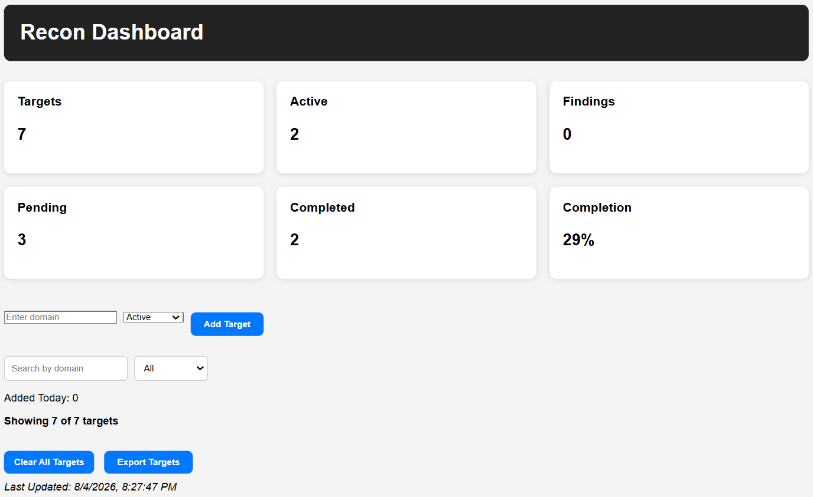
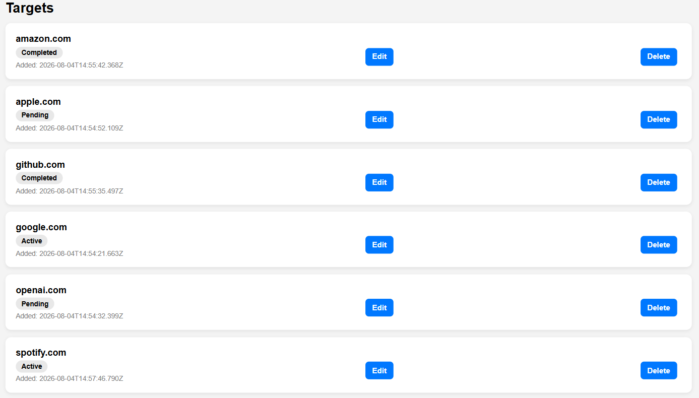
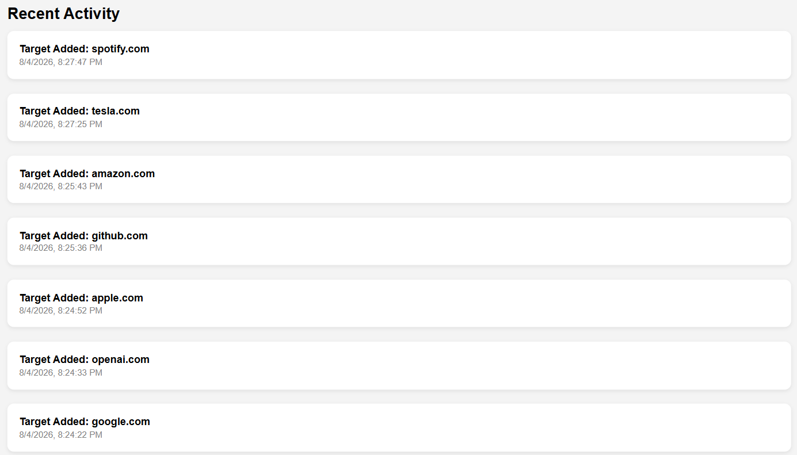
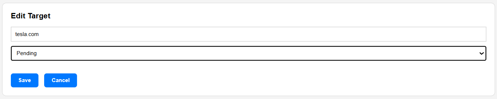
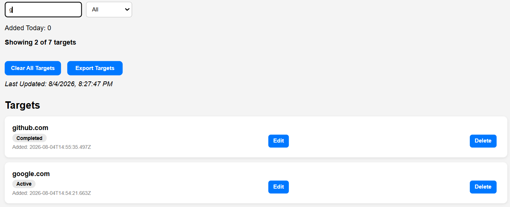

# Recon Dashboard
A responsive reconnaissance dashboard built with HTML, CSS, and Vanilla JavaScript for managing reconnaissance targets during security assessments.

This project was developed as part of a structured learning journey to understand professional frontend development, Git workflows, and software engineering best practices before moving to backend development.

The application allows users to create, edit, delete, search, and organize reconnaissance targets through a responsive frontend backed by a Node.js/Express REST API with persistent SQLite storage.

## Project Preview

### Dashboard Overview



### Target Management



### Activity Log



### Edit Target



### Search & Filter



## Installation

Clone the repository

```bash
git clone https://github.com/YOUR_USERNAME/recon-dashboard.git
```

Install backend dependencies

```bash
cd backend
npm install
```

Create a `.env` file

```env
PORT=3000
```

Start the backend

```bash
npm start
```

Open `frontend/index.html` using Live Server, or access the deployed application using the live demo link below.

## Live Demo

**Frontend**

https://dapper-moxie-91954f.netlify.app/

**Backend API**

https://recon-dashboard-wi17.onrender.com/

## Project Goals
- Manage reconnaissance targets efficiently
- Organize reconnaissance data in a centralized dashboard
- Learn frontend development using HTML, CSS, and JavaScript
- Practice professional Git and GitHub workflows
- Build a complete full-stack web application
- Learn REST API development and database integration
- Practice deploying applications to the cloud# Tech Stack

## Tech Stack

### Frontend

- HTML5
- CSS
- JavaScript

### Backend

- Node.js
- Express.js

### Database

- SQLite

### Deployment

- Netlify
- Render

### Version Control

- Git
- GitHub

## Architecture

```text
Frontend (HTML, CSS, JavaScript)
            │
            ▼
REST API (Node.js + Express)
            │
            ▼
SQLite Database
```

## Features

### Target Management
- Add new reconnaissance targets
- Edit existing targets
- Delete targets
- Prevent duplicate entries
- Input validation

### Search & Filtering
- Search targets by domain
- Filter targets by status
- Dynamic result count

### Dashboard Insights
- Total targets
- Active targets
- Pending targets
- Completed targets
- Completion percentage
- Targets added today

### Activity Tracking
- Activity log for target actions
- Persistent activity history using browser Local Storage

### Data Management
- Persistent SQLite database
- RESTful CRUD API
- Backend validation
- Error handling

### User Experience
- Responsive layout for desktop and mobile devices
- Accessible form controls
- Improved empty states
- Clean and consistent UI

## Learning Objectives

This project helps me strengthen my understanding of:

- Software Engineering Principles
- Full-Stack Web Development
- JavaScript Fundamentals
- DOM Manipulation
- Responsive UI Design
- Git & GitHub Workflow
- Project Architecture
- Professional Software Development Practices

## API Endpoints

- GET /api/targets
- POST /api/targets
- PUT /api/targets/:id
- DELETE /api/targets/:id

Detailed API documentation is available in `backend/API.md`.

## Future Improvements

- User authentication
- Team collaboration
- Automated reconnaissance integration
- Findings management
- File attachments
- PostgreSQL support